# INVARIANT — Architecture

**Deterministic Trust Infrastructure for Bittensor**  
*by Orthonode Infrastructure Labs*

---

## Table of Contents

1. [System Overview](#system-overview)
2. [Three-Layer Trust Stack](#three-layer-trust-stack)
3. [Receipt Lifecycle](#receipt-lifecycle)
4. [Four-Gate Verification Pipeline](#four-gate-verification-pipeline)
5. [OAP Lifecycle State Machine](#oap-lifecycle-state-machine)
6. [Miner Architecture](#miner-architecture)
7. [Validator Architecture](#validator-architecture)
8. [Tempo Cycle Sequence](#tempo-cycle-sequence)
9. [Rust/Python Bridge](#rustpython-bridge)
10. [Data Flow Diagram](#data-flow-diagram)
11. [Component Dependency Graph](#component-dependency-graph)
12. [NTS Scoring Formula](#nts-scoring-formula)
13. [Attack Vector Map](#attack-vector-map)
14. [Deployment Topology](#deployment-topology)

---

## System Overview

INVARIANT is a Bittensor subnet that produces a cryptographically-verified **INVARIANT Trust Score (NTS)** per miner. Where every other subnet scores miners on *outputs*, INVARIANT proves *how* those outputs were produced.

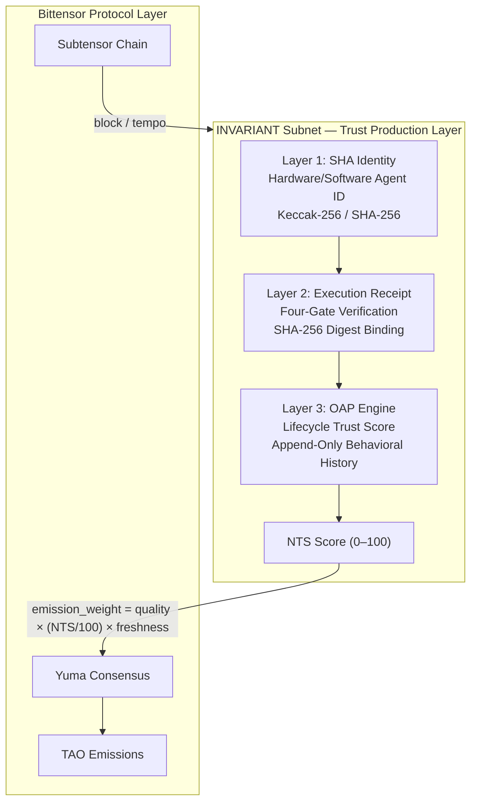

---

## Three-Layer Trust Stack

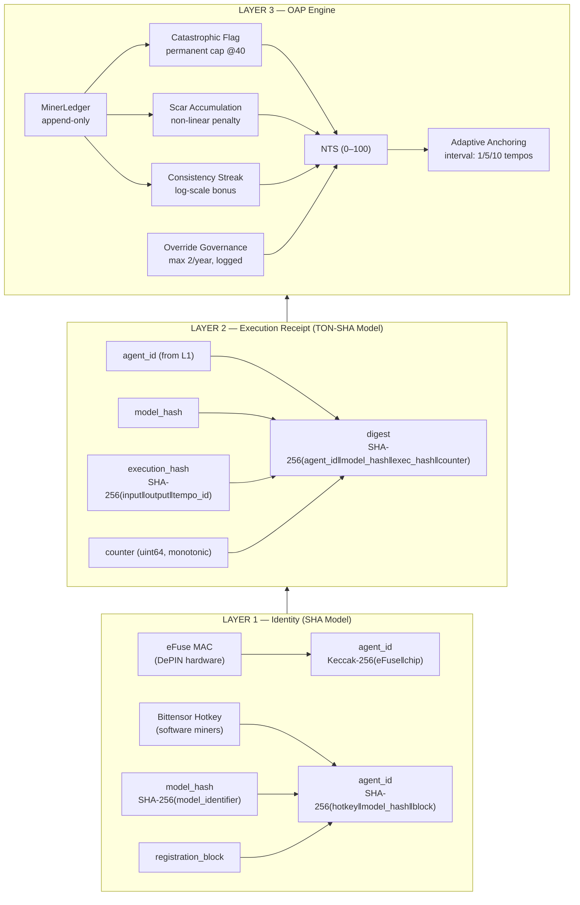

---

## Receipt Lifecycle

```mermaid
sequenceDiagram
    participant V as Validator
    participant M as Miner
    participant GE as Gate Engine
    participant OAP as OAP Engine
    participant BT as Bittensor Chain

    Note over V,BT: Every Bittensor tempo (~12s/block × tempo_length blocks)

    BT->>V: New block / tempo tick
    V->>V: generate_task(tempo, uid)<br/>→ deterministic per (tempo, uid)
    V->>M: InvariantTask(task_input, tempo_id, task_type)
    
    Note over M: Part 1 — Execute Task
    M->>M: output = execute_task(task_input, task_type)
    M->>M: counter += 1; save_counter()
    
    Note over M: Part 2 — Build Receipt
    M->>M: execution_hash = SHA-256(task_input ‖ output ‖ tempo_id)
    M->>M: digest = SHA-256(agent_id ‖ model_hash ‖ execution_hash ‖ counter)
    M->>M: receipt = {agent_id, model_hash, execution_hash, counter, digest}
    
    Note over M: Part 3 — OAP Checkpoint (if due)
    M->>OAP: should_anchor(agent_id, tempo)?
    OAP-->>M: True/False
    opt Anchor due
        M->>OAP: checkpoint(agent_id, tempo)
        OAP-->>M: signed checkpoint dict
    end
    
    M->>V: InvariantTask(output, receipt_json, checkpoint_json)
    
    Note over V,GE: Tier 1 — Four-Gate Verification
    V->>GE: verifier.verify(receipt_dict)
    GE->>GE: Gate 1: agent_id in registry?
    GE->>GE: Gate 2: model_hash approved?
    GE->>GE: Gate 3: counter > last_confirmed?
    GE->>GE: Gate 4: SHA-256(...) == digest?
    GE-->>V: {result, gate_number, detail}
    
    Note over V,OAP: Tier 2 — Quality Scoring
    V->>V: quality = score_output(task_input, task_type, output)
    
    Note over V,OAP: Tier 3 — NTS Multiplier
    V->>OAP: get_nts(agent_id)
    OAP-->>V: nts (0–100)
    
    alt All gates passed
        V->>OAP: record_clean(agent_id, tempo)
        V->>V: weight = quality × (nts/100) × freshness
    else Gate failed
        V->>OAP: record_violation(agent_id, tempo, gate, vtype, detail)
        V->>V: weight = 0.0
    end
    
    V->>BT: set_weights(uids, weights)
    BT->>BT: Yuma Consensus aggregation
    BT->>M: TAO emission (proportional to weight)
```

---

## Four-Gate Verification Pipeline

```mermaid
flowchart TD
    START([Receipt Received]) --> PARSE{Parse JSON}
    PARSE -->|Parse error| FAIL_PARSE[/"❌ PARSE_ERROR\ngate_number: 4\nScore: 0.0"/]
    PARSE -->|Valid JSON| G1

    G1{Gate 1\nIdentity Authorization\nIs agent_id in\nauthorized registry?}
    G1 -->|NO| FAIL1[/"❌ GATE1_AGENT_NOT_AUTHORIZED\ngate_number: 1\nScore: 0.0\n\nBlocks: Sybil, unknown agents,\ncross-miner copying"/]
    G1 -->|YES| G2

    G2{Gate 2\nModel Approval\nIs model_hash in\napproved list?}
    G2 -->|NO| FAIL2[/"❌ GATE2_MODEL_NOT_APPROVED\ngate_number: 2\nScore: 0.0\n\nBlocks: Model impersonation,\nundeclared model swaps"/]
    G2 -->|YES| G3

    G3{Gate 3\nReplay Protection\ncounter > last_confirmed\nfor this agent_id?}
    G3 -->|NO| FAIL3[/"❌ GATE3_REPLAY_DETECTED\ngate_number: 3\nScore: 0.0\n\nBlocks: Replay attacks,\ncounter rollback"/]
    G3 -->|YES| G4

    G4{Gate 4\nDigest Verification\nSHA-256(agent_id ‖ model_hash\n‖ execution_hash ‖ counter)\n== receipt.digest?}
    G4 -->|NO| FAIL4[/"❌ GATE4_DIGEST_MISMATCH\ngate_number: 4\nScore: 0.0\n\nBlocks: Any field tampering,\noutput forgery, caching"/]
    G4 -->|YES| PASS

    PASS[/"✅ PASS\ngate_number: 0\nProceeds to quality scoring"/]

    style PASS fill:#1a4a1a,color:#00ff00
    style FAIL1 fill:#4a1a1a,color:#ff6666
    style FAIL2 fill:#4a1a1a,color:#ff6666
    style FAIL3 fill:#4a1a1a,color:#ff6666
    style FAIL4 fill:#4a1a1a,color:#ff6666
    style FAIL_PARSE fill:#4a1a1a,color:#ff6666
```

---

## OAP Lifecycle State Machine

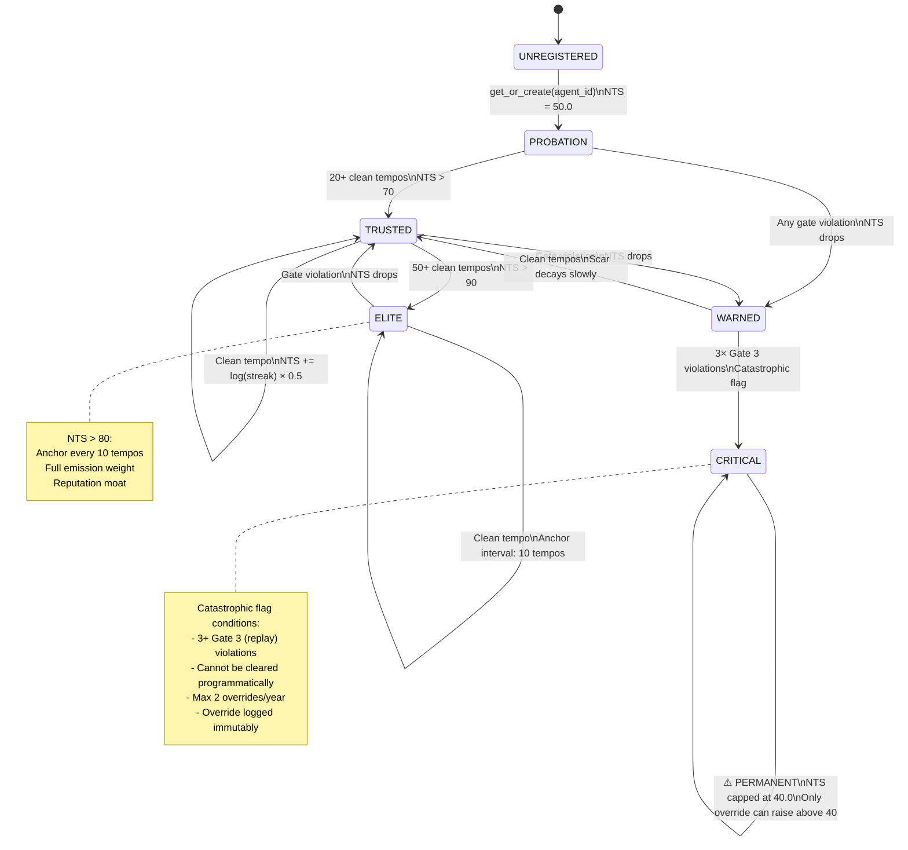

---

## Miner Architecture

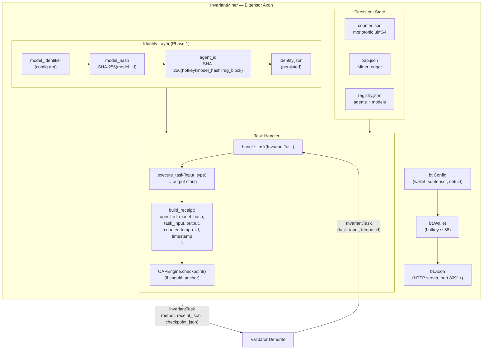

---

## Validator Architecture

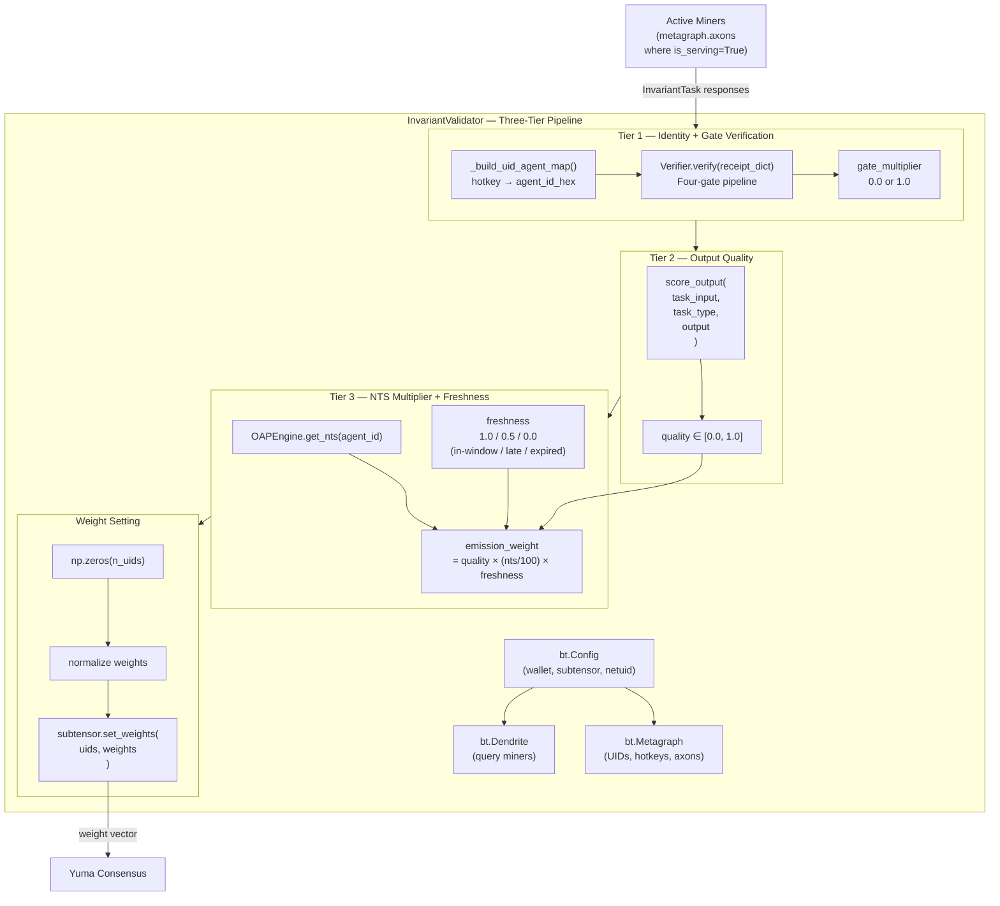

---

## Tempo Cycle Sequence

```mermaid
gantt
    title INVARIANT Validator Tempo Cycle (tempo = 100 blocks × 12s = 1200s)
    dateFormat X
    axisFormat %Ls

    section Setup
    Metagraph sync           :a1, 0, 5000
    Build UID→agent map      :a2, 5000, 8000

    section Task Dispatch
    Generate tasks (per UID) :b1, 8000, 10000
    Query miner 1            :b2, 10000, 30000
    Query miner 2            :b3, 10000, 30000
    Query miner N            :b4, 10000, 30000

    section Scoring
    Tier 1 gate verification :c1, 30000, 35000
    Tier 2 quality scoring   :c2, 35000, 40000
    Tier 3 NTS multiplication:c3, 40000, 42000
    Weight normalization      :c4, 42000, 43000

    section Commit
    set_weights on chain     :d1, 43000, 50000
    OAP ledger save          :d2, 50000, 52000
    Sleep until next tempo   :d3, 52000, 120000
```

---

## Rust/Python Bridge

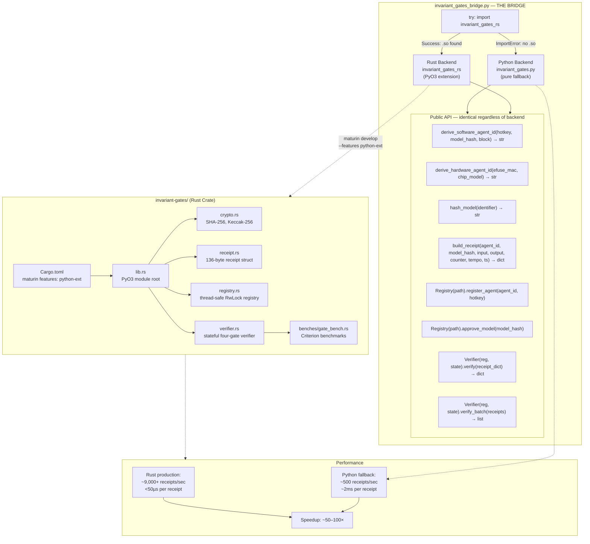

---

## Data Flow Diagram

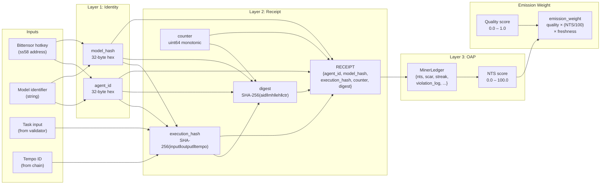

---

## Component Dependency Graph

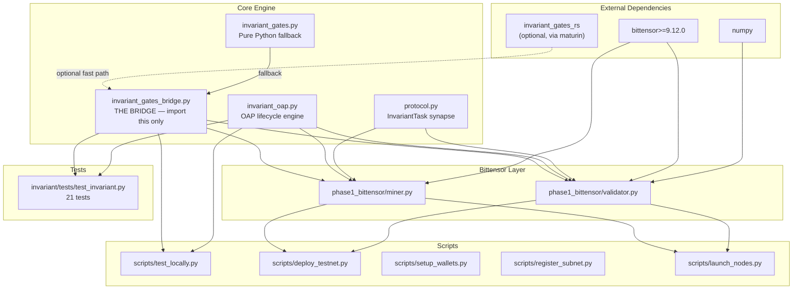

---

## NTS Scoring Formula

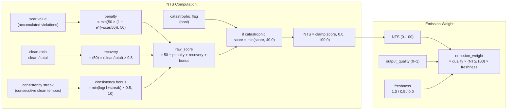

---

## Attack Vector Map

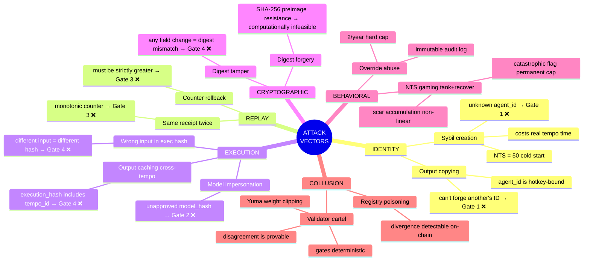

---

## Deployment Topology

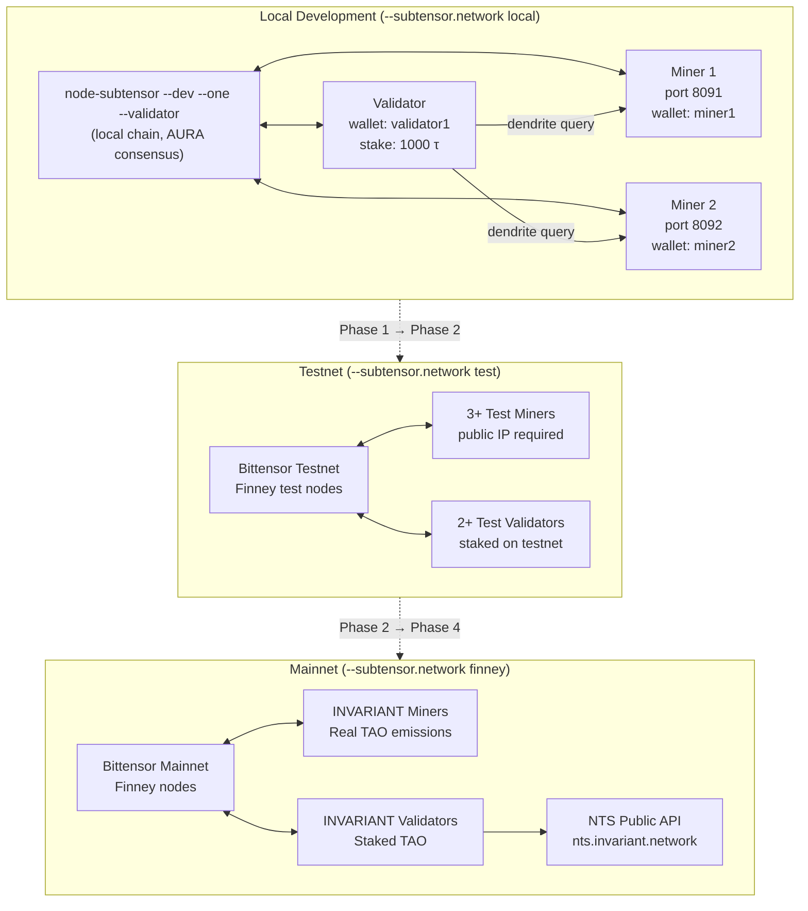

---

## Phase 2 — Testnet Demonstration Targets

The following sequences will be demonstrated live on Bittensor testnet with block explorer links:

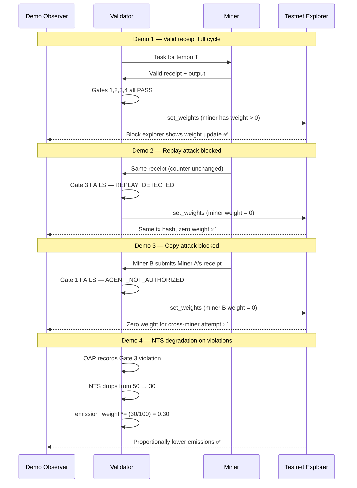

---

*Architecture v1.0.0 — February 2026*  
*Orthonode Infrastructure Labs — orthonode.xyz*